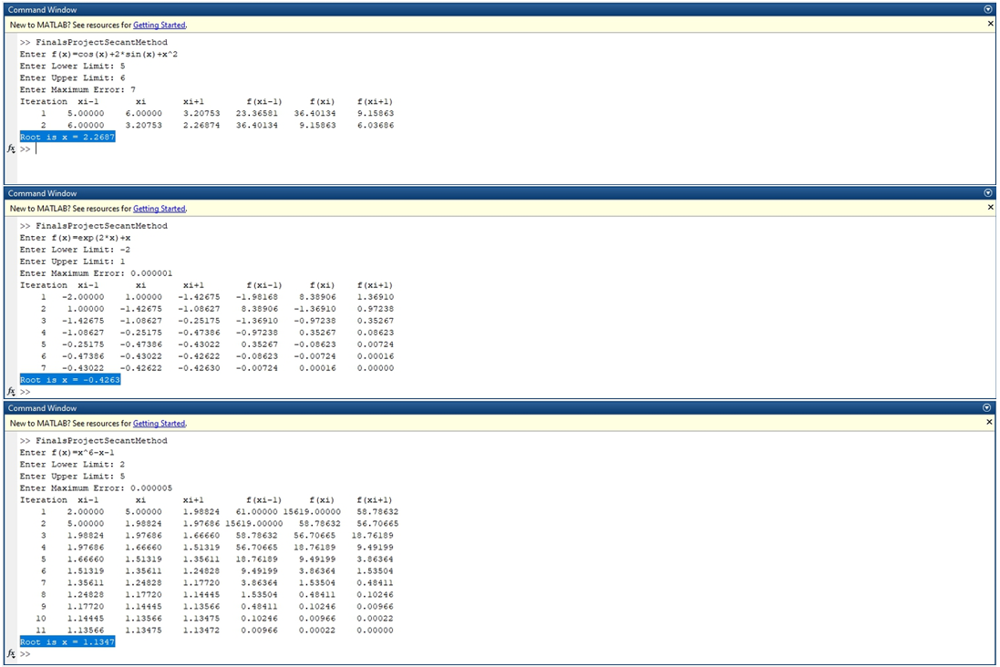

# 📐 Secant Method Solver – MATLAB Script

This project implements the **Secant Method**, a numerical algorithm for finding roots of nonlinear equations using MATLAB. It runs as a command-line script, allowing users to input any equation and compute the root iteratively with a defined error tolerance.

---

## 🚀 Project Overview

This MATLAB script solves nonlinear equations using the Secant Method. It allows the user to input:

- A custom function `f(x)`
- Two initial guesses (`x₀`, `x₁`)
- A desired maximum error tolerance

The program outputs a step-by-step iteration table showing how the root is approximated and concludes once the desired accuracy is reached.

---

## 🧠 Key Features

- Accepts any valid function as input
- Displays full iteration history including:
  - Previous guess `x(i-1)`
  - Current guess `x(i)`
  - Next guess `x(i+1)`
  - Corresponding function values
- User-defined error tolerance
- Up to 100 iterations to ensure convergence
- Highlights root once found

---

## 📷 Sample Output


---

## 📂 Files Included

- `ProjectSecantMethod.m` – Main MATLAB script
- `SecantMethod.png` – Screenshot of sample output

---

## 🛠 How to Use

### Requirements
- MATLAB (R2018 or later recommended)

### Instructions
1. Open MATLAB
2. Run the script:
   ```matlab
   ProjectSecantMethod.m
